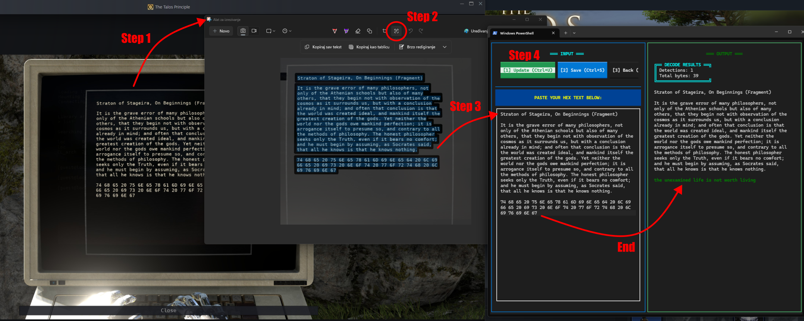

# Talos Decoder



A terminal application designed for decoding hex byte sequences found in terminal windows from **[The Talos Principle](https://store.steampowered.com/app/257510/The_Talos_Principle/)** game. Talos Decoder automatically detects and converts hexadecimal byte sequences (like `48 65 6C 6C 6F`) into their UTF-8 decoded text representation (like `Hello`), while preserving the original text structure.

## About The Talos Principle

This tool is specifically designed to help players decode terminal text in [The Talos Principle](https://store.steampowered.com/app/257510/The_Talos_Principle/) game. The game features terminal windows with hex-encoded text that players need to decode to progress or understand the story.

[The Talos Principle on Steam](https://store.steampowered.com/app/257510/The_Talos_Principle/) - A first-person puzzle game in the tradition of philosophical science fiction, developed by Croteam and published by Devolver Digital.

## Features

- **Automatic Hex Detection** - Intelligently finds hex byte sequences in mixed text
- **Beautiful Terminal UI** - Rich, colorful interface with ASCII art and styling
- **Statistics Dashboard** - View detailed statistics about your decodings
- **History Database** - Automatically saves all processed text to a JSON database
- **History Browser** - Navigate through past decodings with full original/decoded comparison
- **Persistent Storage** - All history saved to `talos_history.json`
- **Side-by-Side Comparison** - See original and decoded text side-by-side with highlighting

## Requirements

- Python 3.7 or higher
- `textual` library (for beautiful terminal UI)

## Installation

1. Clone or download this repository

2. Create a virtual environment (recommended):
```bash
python -m venv venv
```

3. Activate the virtual environment:
   - **Windows:**
     ```bash
     venv\Scripts\activate
     ```
   - **Linux/Mac:**
     ```bash
     source venv/bin/activate
     ```

4. Install dependencies:
```bash
pip install -r requirements.txt
```

## Usage

### Quick Start

Run the application:
```bash
python main.py
```

### Extracting Text from The Talos Principle

Since we're in the AI age, you can easily extract text from the game's terminal windows:

1. **Using Windows Snipping Tool:**
   - Press `Windows Key + Shift + S` to open Snipping Tool
   - Select the area containing the terminal text
   - The screenshot is copied to clipboard
   - Use OCR (such as the built-in Copilot OCR in Windows 11) or manually copy the hex text from the screenshot
   - Paste into Talos Decoder

2. **Alternative Methods:**
   - Use any screen capture tool (ShareX, Greenshot, etc.)
   - Use OCR software to extract text from screenshots
   - Manually type/copy text from the game terminal

### Main Menu Options

1. **Decode** - Process new text containing hex bytes
2. **History** - Browse through your past decodings
3. **About** - View application information
4. **Exit** - Quit the application

### Decoding Text

1. Click "Decode" button or press `1` from the main menu
2. In the left panel, paste your text containing hex bytes (e.g., `48 65 6C 6C 6F`)
   - You can paste text extracted from game terminal windows
   - Mix normal text and hex sequences freely
3. Click "Update Preview" button or press `Ctrl+U` to decode
4. View the decoded results in the right panel with statistics
5. Click "Save to History" or press `Ctrl+S` to save the result
6. Press `ESC` or click "Back" to return to main menu

### History Browser

Browse through your decoding history:
- Click on any entry to view details
- See original and decoded text side-by-side
- Delete entries you no longer need
- Navigate back to main menu

## Example

**Input:**
```
Hello 48 65 6C 6C 6F World 57 6F 72 6C 64
```

**Output:**
```
Hello Hello World World
```

The hex sequences `48 65 6C 6C 6F` and `57 6F 72 6C 64` are automatically decoded to `Hello` and `World` respectively.

## File Structure

```
Talos Decoder/
├── main.py                 # Application entry point
├── models.py               # Data models
├── decoder.py              # Core hex decoding logic
├── history.py              # History management
├── ui/                     # UI components
│   ├── screens.py          # Compatibility layer (re-exports screens)
│   ├── main_menu_screen.py # Main menu screen
│   ├── decode_screen.py    # Decode screen (input/output panels)
│   ├── history_screen.py   # History browser screens
│   ├── about_screen.py     # About screen
│   ├── constants.py        # UI constants
│   └── formatters.py       # Text formatting
├── requirements.txt        # Python dependencies
├── README.md               # This file
├── ARCHITECTURE.md         # Architecture documentation
└── talos_history.json      # History database (created automatically)
```

## Features in Detail

### Statistics Panel
- Number of hex sequences detected
- Total hex bytes decoded
- Decoded text character count
- Average bytes per sequence
- Input/output size comparison

### History Management
- Automatic saving after each decode
- Timestamp for each entry
- Full original and decoded text storage
- Easy navigation and deletion
- Keeps last 1000 entries (auto-pruning)

### Visual Highlights
- Hex sequences highlighted in yellow
- Decoded text highlighted in green
- Color-coded panels and tables
- ASCII art banners
- Modern terminal styling

## Technical Details

- **Hex Detection**: Uses regex pattern matching to find sequences of 3+ hex byte pairs
- **Encoding**: UTF-8 decoding with error replacement
- **Storage**: JSON format for easy inspection and portability
- **UI Library**: Built with `textual` (Textualize) for cross-platform terminal compatibility

## Tips for The Talos Principle

- Hex bytes in the game are typically space-separated pairs (e.g., `48 65 6C 6C 6F`)
- You can mix normal text and hex sequences freely
- Use Windows Snipping Tool (`Win + Shift + S`) to quickly capture terminal text
- History is stored in `talos_history.json` - you can back it up or share it
- The application automatically handles multi-line text input
- Some terminal windows may have formatting - just paste the raw text

## Dependencies

This project uses the following libraries:

- **[textual](https://github.com/Textualize/textual)** - A TUI (Text User Interface) framework for Python

Note: These libraries have their own licenses. Please refer to their respective repositories for license information.

## License

This project is licensed under the MIT License. The license applies to this project's code only, not to the libraries used (which have their own licenses).

## Contributing

Feel free to submit issues, fork the repository, and create pull requests for any improvements.

---

**Made for The Talos Principle players and hex decoding enthusiasts**
